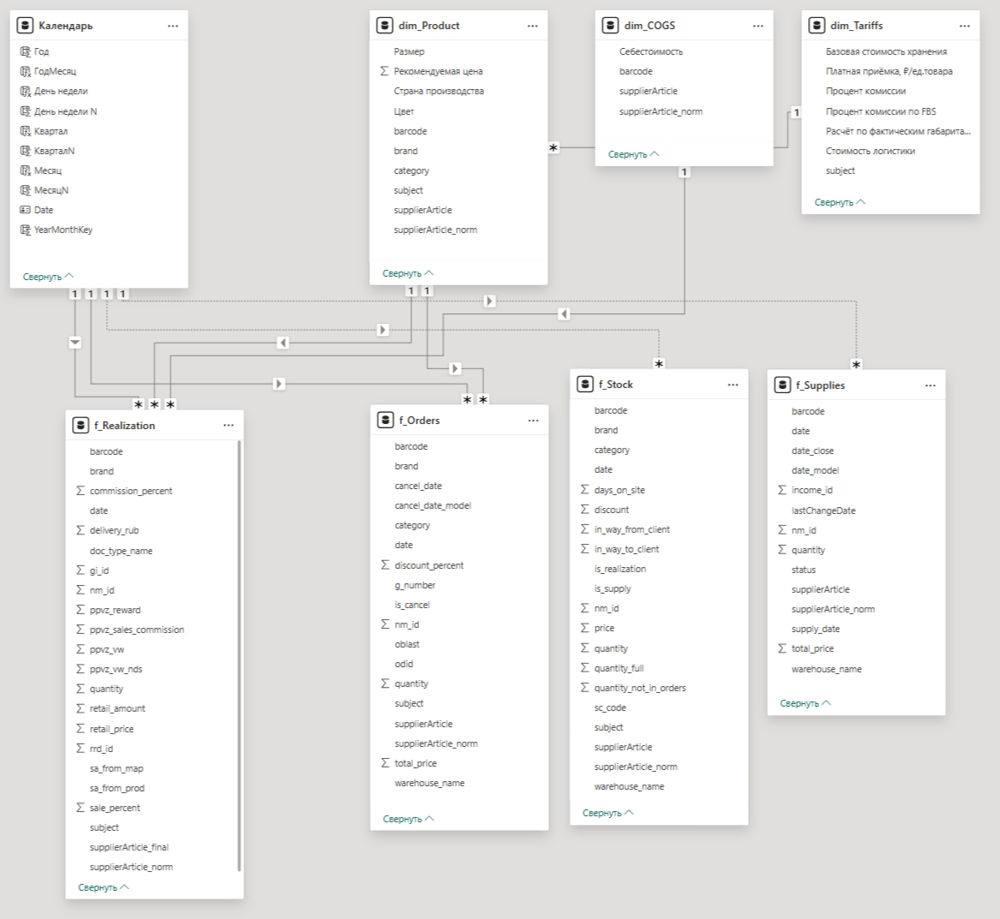
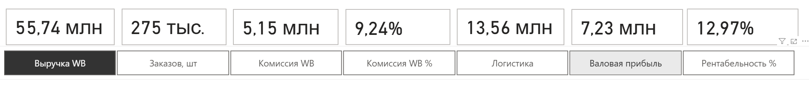
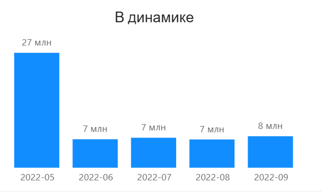
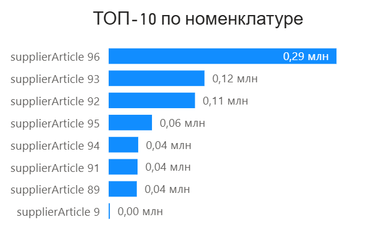
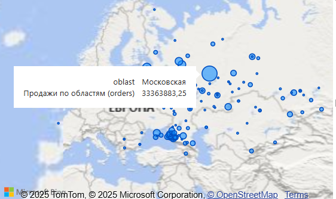
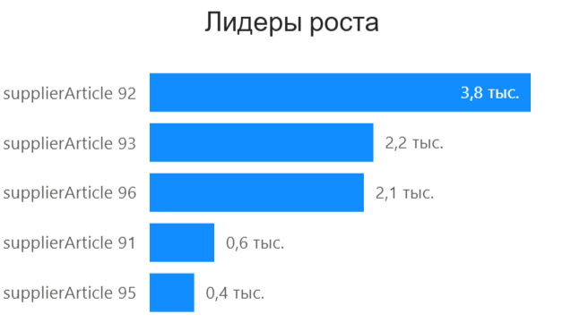
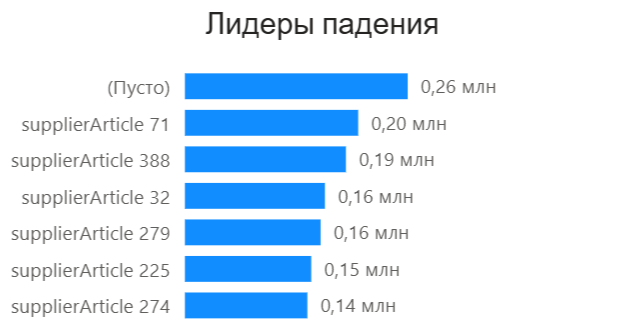
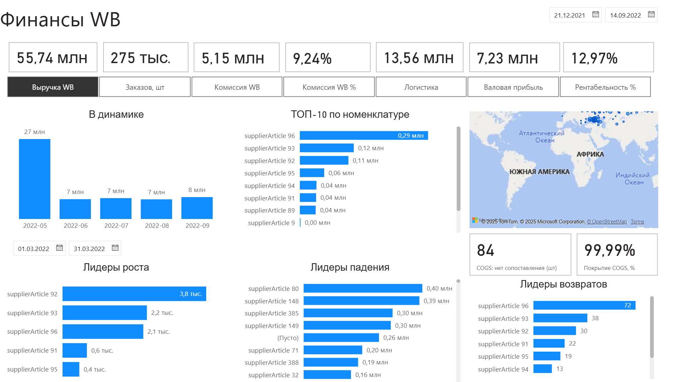
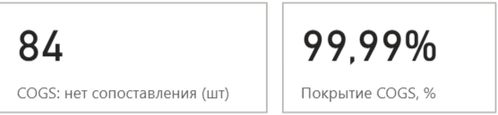

# Аналитика продаж для компании ИП Иванова (Wildberries)

[**⬇️ Скачать отчёт (.pbix)**](pbix/WB_Sales_Analytics_IP_Ivanova.pbix)

> Power BI Desktop: **2.148.878.0 (Октябрь 2025)**  
> Демо-проект: финансы, логистика, рентабельность, TOP-ы рост/падение, карта продаж, QA-страница.

---

## Оглавление
- [О проекте](#о-проекте)
- [Источники данных](#источники-данных)
- [Модель данных](#модель-данных)
- [KPI и методика расчётов](#kpi-и-методика-расчётов)
- [Визуализации](#визуализации)
- [Как воспроизвести](#как-воспроизвести)
- [QA-проверки](#qa-проверки)

---

## О проекте
Интерактивный отчёт **Power BI** для владельца бизнеса на Wildberries:
- показывает **нетто-выручку**, **комиссию**, **логистику**, **COGS**, **валовую прибыль** и **рентабельность**;
- даёт **TOP-10 номенклатуры**, **лидеров роста/падения**, **распределение по регионам**;
- использует **гибридную выручку**: фактические реализации (Realization) + fallback на заказы (Orders) в даты без реализаций;
- содержит **QA-страницу** для сверок и диагностики покрытия COGS.

---

## Источники данных
- **PostgreSQL (WB API выгрузки)**: `f_Realization`, `f_Orders`, `f_Stock`, `f_Supplies`.
- **Google Sheets (через Excel.Workbook(Web.Contents))**:  
  - `dim_Product` — справочник номенклатуры;  
  - `dim_COGS` — себестоимость;  
  - `dim_Tariffs` — тарифы/доставка.

---

## Модель данных
Основные связи:
- `Календарь[date] (1) → f_Realization[date] (*)` (активная)  
- `Календарь[date] (1) → f_Orders[date] (*)` (неактивная, используется в мерах через `USERELATIONSHIP` при необходимости)  
- `dim_Product[supplierArticle_norm] (1) → f_Realization[supplierArticle_norm] (*)`  
- `dim_Product[supplierArticle_norm] (1) → f_Orders[supplierArticle_norm] (*)`  
- `dim_COGS[supplierArticle_norm] (1) → f_Realization[supplierArticle_norm] (*)`

Скрин схемы:  

---

## KPI и методика расчётов
**Методика «нетто из брутто»:**
- *Выручка WB* = `SUMX(f_Realization, ЗнакОперации * retail_amount)`  
- *Комиссия WB*, *Комиссия WB %*, *Логистика* — по факту из `f_Realization` с учётом знака операции.  
- *Выручка, нетто* = Выручка WB − Комиссия WB − Логистика  
- *COGS* — по `supplierArticle_norm`, fall-back по `barcode`.  
- *Валовая прибыль* = Выручка, нетто − COGS  
- *Рентабельность %* = Валовая прибыль / Выручка WB  
- *Заказов, шт* = `DISTINCTCOUNT(f_Orders[odid])`  
- *Средний чек* = Выручка WB / Заказов, шт

**Гибридная выручка:** берём **f_Realization** там, где есть реализации, и **fallback** на псевдо-выручку из **f_Orders** для дат без реализаций, чтобы корректно считать динамику и «предыдущий равный период».

---

## Визуализации
- **Карточки KPI**: Выручка (гибрид), Комиссия WB, Комиссия WB %, Логистика, Валовая прибыль, Рентабельность %, Заказов, шт, Средний чек.  
  

- **Срезы**:  
  - Дата (Between / Relative)  
  - Чип-переключатель `param_KPI_Графики` для смены показателя на графиках

- **В динамике** (график): переключается чипами KPI.  
  

- **ТОП-10 по номенклатуре** (линейчатая диаграмма с группировкой): сортировка по выбранному KPI, фильтр «Ведущие № = 10».  
  

- **Карта / Заполненная карта**: распределение по регионам.  
  

- **Лидеры роста / Лидеры падения** (линейчатые диаграммы с группировкой): по дельте гибридной выручки за выбранный период vs предыдущий равный период.  
    
  

- **Общий вид страницы**:  
  

---

## Как воспроизвести
1. **Скачать .pbix:** [WB_Sales_Analytics_IP_Ivanova.pbix](pbix/WB_Sales_Analytics_IP_Ivanova.pbix)  
2. **Открыть в Power BI Desktop** (2.148.878.0 или новее).  
3. **Обновить источники (при необходимости):**  
   - **PostgreSQL:** Главная → Преобразование данных → Источники данных → PostgreSQL → задать `HOST/PORT/DB/USER/PASSWORD`.  
   - **Google Sheets:** источники в PQ подключены через `Excel.Workbook(Web.Contents(...))`. Достаточно анонимного доступа к `docs.google.com` (если листы публичные/по ссылке).
4. **Проверить связи** (см. раздел *Модель данных* и `images/08_model.png`).  
5. **Нажать Обновить**: Главная → **Обновить**.  
6. *(Опционально)* **Календарь**: таблица отмечена как «Таблица дат», сортировки:  
   - Месяц → по МесяцN  
   - День недели → по ДеньНеделиN  
   - ГодМесяц → по YearMonthKey

---

## QA-проверки
Страница QA (или временная зона отчёта):  

Что проверяем:
- **Строки f_Realization / f_Orders** — реагируют на срез даты.  
- **COGS: нет сопоставления (шт)** — стремится к **0**; **Покрытие COGS, %** близко к **100%**.  
- Таблица диагностики `barcode × supplierArticle_norm` помогает быстро найти проблемные SKU.

